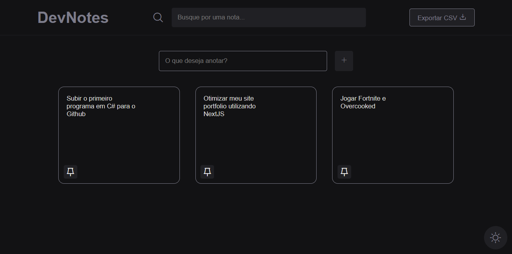

<h1 align="center">DevNotes</h1>

Bem-vindo ao meu projeto de Gerenciamento de Notas! Este sistema foi desenvolvido para simplificar a organização das suas notas de forma eficaz. Com ele, você pode facilmente criar, pesquisar, fixar, editar e excluir suas notas, oferecendo uma maneira conveniente e flexível de gerenciar suas informações pessoais.

## Tecnologias
Projeto bem legal, desenvolvido utilizando as seguintes tecnologias:

- HTML e CSS
- TypeScript
- ViteJS

## Informações Úteis
Para criação do projeto, foi utilizado o Vite.

### Instalação
- `npm install`

### Para rodar o projeto
- `npm run dev`